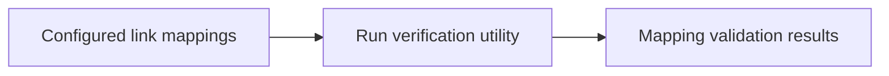

# Scripts

<!-- directory-responsibility -->
Verifies the filesystem link mappings owned by the link package.

Key files: `verify.ts`.

```mermaid
flowchart LR
    A["Configured link mappings"] --> B["Run verification utility"]
    B --> C["Mapping validation results"]
```
