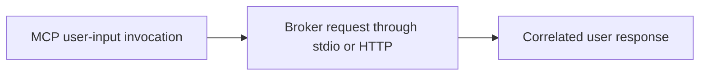

# Server

<!-- directory-responsibility -->
Implements MCP server transports and the broker for user-input requests.

Key files: `index.ts`, `shared.ts`, `stdio.ts`, `userInputBroker.ts`.

```mermaid
flowchart LR
    A["MCP user-input invocation"] --> B["Broker request through stdio or HTTP"]
    B --> C["Correlated user response"]
```
