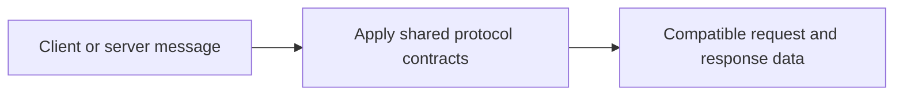

# Shared

<!-- directory-responsibility -->
Defines user-input protocol messages shared by the MCP server and client.

Key files: `humanProtocol.ts`, `userInput.ts`.

```mermaid
flowchart LR
    A["Client or server message"] --> B["Apply shared protocol contracts"]
    B --> C["Compatible request and response data"]
```
