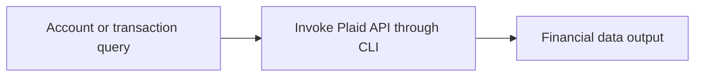

# Plaid

<!-- directory-responsibility -->
Provides a CLI for retrieving Plaid account and transaction data in supported environments.

Detailed usage and existing reference material: [README.md](README.md).

Key files: `package.json`, `specification.md`, `tsconfig.json`.

