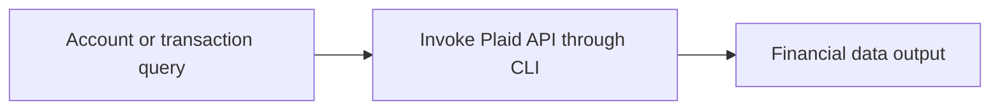

# Src

<!-- directory-responsibility -->
Implements the plaid package behavior. Provides a CLI for retrieving Plaid account and transaction data in supported environments.

Key files: `index.ts`.

```mermaid
flowchart LR
    A["Account or transaction query"] --> B["Invoke Plaid API through CLI"]
    B --> C["Financial data output"]
```
