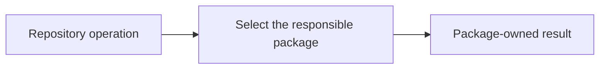

# Packages

<!-- directory-responsibility -->
Groups separately configured packages that implement the repository capabilities.

```mermaid
flowchart LR
    A["Repository operation"] --> B["Select the responsible package"]
    B --> C["Package-owned result"]
```
