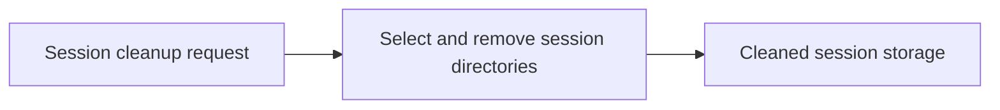

# Session

<!-- directory-responsibility -->
Provides a utility for purging Copilot session directories.

Detailed usage and existing reference material: [README.md](README.md).

Key files: `specification.md`.

