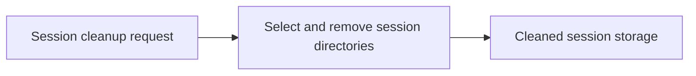

# Src

<!-- directory-responsibility -->
Implements the session package behavior. Provides a utility for purging Copilot session directories.

Key files: `index.ts`.

```mermaid
flowchart LR
    A["Session cleanup request"] --> B["Select and remove session directories"]
    B --> C["Cleaned session storage"]
```
