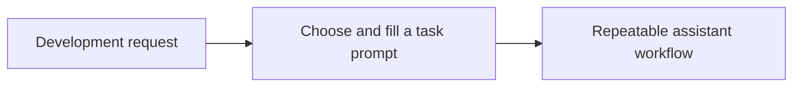

# Prompts

<!-- directory-responsibility -->
Stores reusable prompts for maintenance, implementation, review, and session workflows.

Key files: `align.prompt.md`, `chatmode.prompt.md`, `chrome-devtools.prompt.md`, `clean.prompt.md`, `complexity.prompt.md`, `git-state.prompt.md`, `identify.prompt.md`, `improve.prompt.md`, `learn.prompt.md`, `links.prompt.md`.

