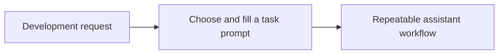

# Prompts

<!-- directory-responsibility -->
Stores reusable prompts for maintenance, implementation, review, and session workflows.

Key files: `align.prompt.md`, `chatmode.prompt.md`, `chrome-devtools.prompt.md`, `clean.prompt.md`, `complexity.prompt.md`, `git-state.prompt.md`, `identify.prompt.md`, `improve.prompt.md`, `learn.prompt.md`, `links.prompt.md`.

Git tracking defaults to exclusion. Each tracked directory owns a `.gitignore` that explicitly allows its important immediate files and child directories. Add an allowlist entry when introducing content intended for version control, and give each new child directory its own `.gitignore`. This repository applies the workspace policy independently; its root rules cover root entries only. Existing responsibilities and the diagram remain unchanged.
