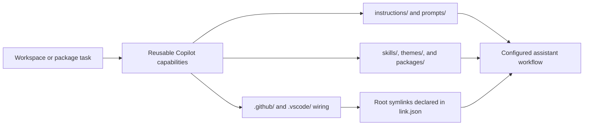

# Copilot

<!-- directory-responsibility -->

Supplies shared Copilot instructions, prompts, skills, shared agents, and supporting command-line utilities. The workspace reaches this repository's `.github/` and `.vscode/` wiring through the root symlinks declared in `link.json`.

Detailed usage and existing reference material: [README.md](README.md).

Key files: `package.json`, `pnpm-workspace.yaml`, `specification.md`.

The agent skill catalog that lived in `.agents/` moved to the `storage` vault on 2026-09-24, so this repository no longer carries it. The workspace keeps the four entrypoints it exposes as relative symlinks into `storage/.agents/skills/`.

Git tracking defaults to exclusion. Each tracked directory owns a `.gitignore` that explicitly allows its important immediate files and child directories. Add an allowlist entry when introducing content intended for version control, and give each new child directory its own `.gitignore`. This repository applies the workspace policy independently; its root rules cover root entries only.

The main branch integrates the shared capability updates and directory allowlists.
