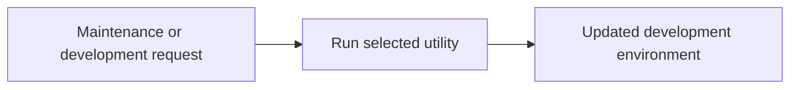

# Scripts

<!-- directory-responsibility -->
Provides session lifecycle and skill-synchronization utilities.

Key files: `session-end.sh`, `sync-skills.ts`.

```mermaid
flowchart LR
    A["Maintenance or development request"] --> B["Run selected utility"]
    B --> C["Updated development environment"]
```
