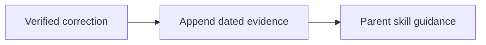

# OpenClaw correction evidence

[corrections.md](corrections.md) owns verified, dated correction evidence for the parent skill. It begins without invented historical entries.

```mermaid
flowchart LR
    V[Verified correction] --> L[Append dated evidence]
    L --> S[Parent skill guidance]
```
